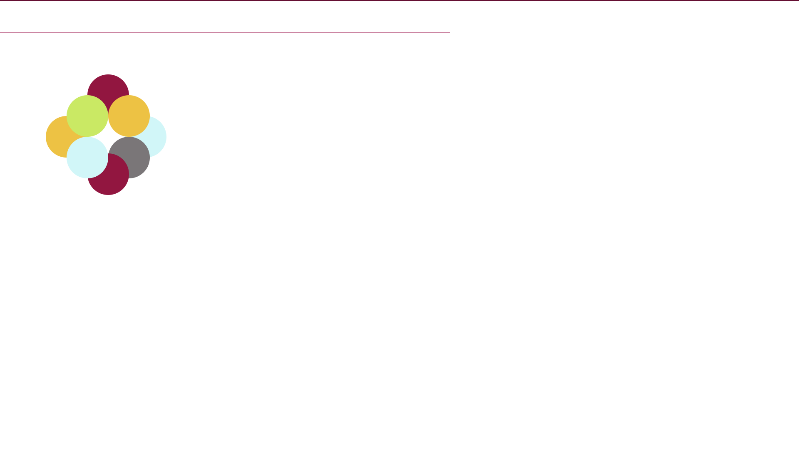

<h1 align="center">Shapes-Exercise</h1>

<h4 align="center">Layering shapes of varying colors at different z positions to create a picture.</h4>
 

 
  

### Description 

- This exercise generates a static picture by layering balls of different colors at different z positions.

### To Run this Program

In order to run this file, Fork and Clone the repository to your local machine and open the index.html file in a browser.

### Future RoadMap

This project can be still be enhanced by 

- adding animation to the static picture.

- clicking a button to make shapes move to random positions once the picture is formed.
  
### License

> MIT License
> Copyright (c) 2022 Sujatha Arunagiri
> Permission is hereby granted, free of charge, to any person obtaining a copy
> of this software and associated documentation files (the "Software"), to deal
> in the Software without restriction, including without limitation the rights
> to use, copy, modify, merge, publish, distribute, sublicense, and/or sell
> copies of the Software, and to permit persons to whom the Software is
> furnished to do so, subject to the following conditions:
> The above copyright notice and this permission notice shall be included in all
> copies or substantial portions of the Software.
> THE SOFTWARE IS PROVIDED "AS IS", WITHOUT WARRANTY OF ANY KIND, EXPRESS OR
> IMPLIED, INCLUDING BUT NOT LIMITED TO THE WARRANTIES OF MERCHANTABILITY,
> FITNESS FOR A PARTICULAR PURPOSE AND NONINFRINGEMENT. IN NO EVENT SHALL THE
> AUTHORS OR COPYRIGHT HOLDERS BE LIABLE FOR ANY CLAIM, DAMAGES OR OTHER
> LIABILITY, WHETHER IN AN ACTION OF CONTRACT, TORT OR OTHERWISE, ARISING FROM,
> OUT OF OR IN CONNECTION WITH THE SOFTWARE OR THE USE OR OTHER DEALINGS IN THE
> SOFTWARE.

  
